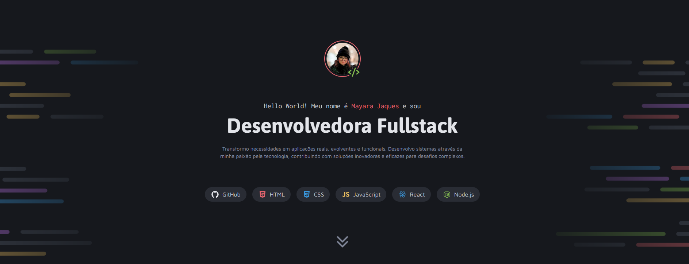
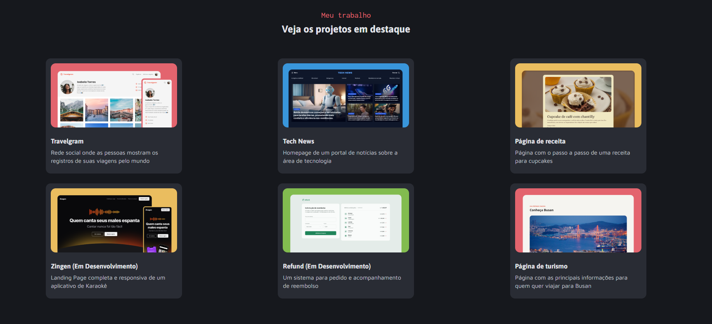

# 🖥️ Meu Portfólio - Mayara Jaques

**Projeto desenvolvido com os conhecimentos adquiridos com o curso da Rocketseat.**


 
 

## 🚀 O Que é?

Esse é o meu portfólio online! Aqui você pode conhecer um pouco mais sobre mim, minhas habilidades e conferir alguns dos projetos que já desenvolvi. A ideia é ter um espaço onde eu possa mostrar meu trabalho e aprendizado na área de desenvolvimento.

## 🛠️ Tecnologias Usadas

- **HTML**: Para estruturar tudo.
- **CSS**: Para deixar tudo bonito e responsivo.
- **JavaScript**: Para adicionar aquela interatividade.
- **GitHub Pages**: Onde meu portfólio está hospedado.

## 📦 Como Rodar o Projeto

1. Clone o repositório:

   ```bash
   git clone https://github.com/mayarajaques/projeto-portfolio-dev.git

  2. Navegue até a pasta do projeto:

   ```bash
    cd projeto-portfolio-dev
```
3. Abra o index.html no seu navegador preferido.


## 🌐 Confira Meu Portfólio
Você pode ver o projeto ao vivo aqui: [Meu Portfólio](https://mayarajaques.github.io/projeto-portfolio-dev/)

## 📫 Como Me Encontrar:

LinkedIn: [Mayara Jaques](https://www.linkedin.com/in/mayarajaques/)

Email: maayjaques@gmail.com

📝 Contribuições
Se você tiver sugestões ou ideias para melhorar meu portfólio, fique à vontade para abrir uma issue ou fazer um pull request. Estou sempre aberta a feedback!

## 👩‍💻 Agradecimentos
Um agradecimento especial a todos que me ajudaram nessa jornada. Estou sempre aprendendo e buscando crescer na área!

Valeu por dar uma olhada no meu portfólio! 😊
